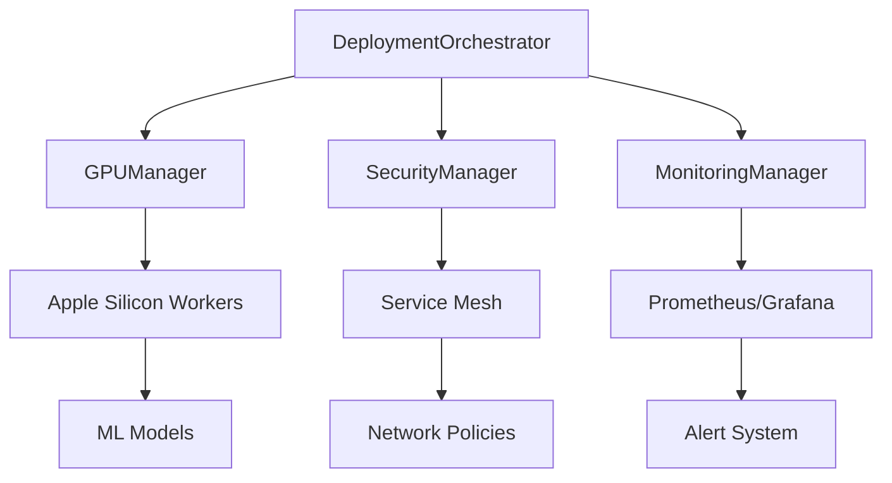

# Gordon Gekko Production Deployment Architecture - Apple Silicon Optimized

## Executive Summary

This document defines the comprehensive production deployment architecture for the Gordon Gekko autonomous trading system, specifically optimized for Apple Silicon M1/M2 processors with multi-GPU support. The architecture ensures enterprise-grade security, performance, and scalability while maintaining the system's autonomous trading capabilities across multiple platforms.

## Architecture Overview

### System Context

```
┌─────────────────────────────────────────────────────────────────────────┐
│                         External Systems                               │
├─────────────────────────────────────────────────────────────────────────┤
│  • Trading Platforms: Coinbase Pro, Binance.US, OANDA                   │
│  • ML Services: OpenRouter, LiteLLM, Custom Models                     │
│  • Market Data Providers: Real-time feeds, Historical data             │
│  • Security Infrastructure: SIEM, IDS/IPS, Compliance systems          │
│  • Monitoring Systems: Prometheus, Grafana, ELK Stack                  │
│  • Cloud Infrastructure: Multi-region, multi-provider support          │
└─────────────────────────────────────────────────────────────────────────┘
                                     │
                                     ▼
┌─────────────────────────────────────────────────────────────────────────┐
│                   Production Deployment Layer                           │
├─────────────────────────────────────────────────────────────────────────┤
│  • Multi-Region Kubernetes Clusters                                    │
│  • Apple Silicon GPU Workers (MPS + CUDA)                              │
│  • Service Mesh with Zero-Trust Security                               │
│  • CI/CD Pipeline with Blue-Green Deployments                          │
│  • Automated Monitoring and Alerting                                  │
└─────────────────────────────────────────────────────────────────────────┘
                                     │
                                     ▼
┌─────────────────────────────────────────────────────────────────────────┐
│                   Gordon Gekko Trading System                          │
├─────────────────────────────────────────────────────────────────────────┤
│  • Autonomous Trading Engine  • Multi-Platform Integration             │
│  • Advanced ML & Analytics    • Real-time UI & API Ecosystem           │
└─────────────────────────────────────────────────────────────────────────┘
```

## Production Deployment Architecture

### 1. Infrastructure Layer

#### Apple Silicon Optimization Strategy

**M1/M2 GPU Architecture:**
- **Metal Performance Shaders (MPS)**: Native Apple Silicon GPU acceleration
- **CUDA Compatibility Layer**: NVIDIA CUDA kernel support via Metal
- **Unified Memory Architecture**: Efficient CPU-GPU memory sharing
- **Neural Engine Integration**: Dedicated AI processing capabilities

**Multi-GPU Deployment:**
```
┌─────────────────────────────────────────────────────────────────────────┐
│                    Apple Silicon GPU Cluster                           │
├─────────────────────────────────────────────────────────────────────────┤
│  ┌─────────────┐  ┌─────────────┐  ┌─────────────┐  ┌─────────────┐    │
│  │  M1/M2 GPU  │  │  M1/M2 GPU  │  │  M1/M2 GPU  │  │  M1/M2 GPU  │    │
│  │  Worker 1   │  │  Worker 2   │  │  Worker 3   │  │  Worker 4   │    │
│  │             │  │             │  │             │  │             │    │
│  │ • MPS Core  │  │ • MPS Core  │  │ • MPS Core  │  │ • MPS Core  │    │
│  │ • CUDA     │  │ • CUDA     │  │ • CUDA     │  │ • CUDA     │    │
│  │   Bridge   │  │   Bridge   │  │   Bridge   │  │   Bridge   │    │
│  └─────────────┘  └─────────────┘  └─────────────┘  └─────────────┘    │
│           │              │              │              │              │
│           └──────────────┼──────────────┼──────────────┼──────────────┘
│                          │              │              │
│                    ┌─────▼──────────────▼──────────────▼─────────────┐
│                    │          GPU Resource Manager                    │
│                    ├─────────────────────────────────────────────────┤
│                    │ • Load Balancing     • Memory Management        │
│                    │ • Model Distribution • Performance Monitoring   │
│                    │ • Failover Handling  • Resource Optimization    │
│                    └─────────────────────────────────────────────────┘
└─────────────────────────────────────────────────────────────────────────┘
```

**GPU Resource Management:**
- **Dynamic Load Balancing**: Distribute ML workloads across available GPUs
- **Memory Pool Management**: Efficient GPU memory allocation and cleanup
- **Model Parallelism**: Split large models across multiple GPU workers
- **Performance Monitoring**: Real-time GPU utilization and bottleneck detection

### 2. Deployment Orchestrator Service

#### Service Architecture

**DeploymentOrchestrator** - Main coordination system with clear boundaries:

**Responsibilities:**
- Coordinate end-to-end deployment lifecycle
- Manage deployment phases: validation → preparation → activation → verification
- Handle rollback and disaster recovery procedures
- Provide deployment status tracking and comprehensive reporting
- Support multiple deployment strategies (blue-green, canary, rolling)

**Key Components:**
```
DeploymentOrchestrator
├── EnvironmentValidator
│   ├── HardwareCompatibilityChecker
│   ├── SoftwareDependencyValidator
│   ├── NetworkConnectivityTester
│   └── SecurityConfigurationValidator
├── DeploymentCoordinator
│   ├── ServiceDependencyResolver
│   ├── ContainerOrchestrator
│   ├── ConfigurationManager
│   └── HealthCheckManager
├── RollbackManager
│   ├── StateSnapshotManager
│   ├── RecoveryProcedureExecutor
│   └── ValidationManager
└── MonitoringManager
    ├── MetricsCollector
    ├── AlertManager
    └── StatusReporter
```

#### Deployment Pipeline Architecture

```
┌─────────────────────────────────────────────────────────────────────────┐
│                          CI/CD Pipeline                                 │
├─────────────────────────────────────────────────────────────────────────┤
│  ┌─────────────┐  ┌─────────────┐  ┌─────────────┐  ┌─────────────┐    │
│  │   Source    │  │   Build &   │  │   Test &    │  │   Deploy    │    │
│  │ Repository  │  │   Package   │  │ Validation  │  │  Stage      │    │
│  │             │  │             │  │             │  │             │    │
│  │ • Git Flow  │  │ • Docker    │  │ • Unit      │  │ • Blue-     │    │
│  │ • Feature   │  │   Images    │  │   Tests     │  │   Green     │    │
│  │   Branches  │  │ • Multi-    │  │ • Integration│  │ • Canary    │    │
│  │             │  │   Arch      │  │ • Security  │  │ • Rolling   │    │
│  └─────────────┘  └─────────────┘  └─────────────┘  └─────────────┘    │
│           │              │              │              │              │
│           └──────────────┼──────────────┼──────────────┼──────────────┘
│                          │              │              │
│                    ┌─────▼──────────────▼──────────────▼─────────────┐
│                    │         Deployment Orchestrator                │
│                    ├───────────────────────────────────────────────┤
│                    │ • Environment Validation                      │
│                    │ • Service Coordination                        │
│                    │ • GPU Resource Management                     │
│                    │ • Security Policy Enforcement                 │
│                    │ • Rollback & Recovery                         │
│                    └───────────────────────────────────────────────┘
└─────────────────────────────────────────────────────────────────────────┘
```

### 3. Service Mesh Architecture

#### Zero-Trust Security Implementation

**ServiceMesh** - Kubernetes-native service mesh with comprehensive security:

**Security Components:**
```
ServiceMesh
├── AuthenticationService
│   ├── mTLS (Mutual TLS) Manager
│   ├── JWT Token Validator
│   ├── Service Identity Provider
│   └── Certificate Authority
├── AuthorizationService
│   ├── Policy Decision Point (PDP)
│   ├── Policy Enforcement Point (PEP)
│   ├── Role-Based Access Control (RBAC)
│   └── Attribute-Based Access Control (ABAC)
├── ObservabilityService
│   ├── Distributed Tracing
│   ├── Metrics Collection
│   ├── Log Aggregation
│   └── Performance Monitoring
└── TrafficManagementService
    ├── Load Balancing
    ├── Circuit Breaker
    ├── Rate Limiting
    └── Traffic Splitting
```

#### Multi-Region Deployment Architecture

```
┌─────────────────────────────────────────────────────────────────────────┐
│                    Multi-Region Kubernetes Clusters                    │
├─────────────────────────────────────────────────────────────────────────┤
│  ┌─────────────────┐  ┌─────────────────┐  ┌─────────────────┐          │
│  │   Region 1      │  │   Region 2      │  │   Region 3      │          │
│  │   (Primary)     │  │   (Secondary)   │  │   (DR)          │          │
│  │                 │  │                 │  │                 │          │
│  │ • K8s Cluster   │  • K8s Cluster   │  • K8s Cluster   │          │
│  │ • GPU Workers   │  • GPU Workers   │  • GPU Workers   │          │
│  │ • Service Mesh  │  • Service Mesh  │  • Service Mesh  │          │
│  │ • Load Balancer │  • Load Balancer │  • Load Balancer │          │
│  └─────────────────┘  └─────────────────┘  └─────────────────┘          │
│           │                   │                   │                      │
│           └───────────────────┼───────────────────┼──────────────────────┘
│                               │                   │
│                         ┌─────▼────────────┐      │
│                         │ Global Traffic   │      │
│                         │ Management       │      │
│                         │                  │      │
│                         │ • Geo-DNS        │      │
│                         │ • Load Balancer  │      │
│                         │ • Health Checks  │      │
│                         │ • Failover       │      │
│                         └──────────────────┘      │
└─────────────────────────────────────────────────────────────────────────┘
```

## Service Boundary Definitions

### Core Deployment Services

#### 1. DeploymentOrchestrator Service
- **Single Responsibility**: Coordinate and manage the complete deployment lifecycle
- **Data Ownership**: Deployment state, configuration, execution history
- **External Interfaces**: Kubernetes API, Docker Registry, Monitoring Systems
- **SLOs**: 99.9% uptime, <5min deployment time, <30sec rollback time
- **Rationale**: Centralized orchestration ensures consistent and reliable deployments

#### 2. GPUManager Service
- **Single Responsibility**: Manage Apple Silicon and CUDA GPU resources
- **Data Ownership**: GPU allocation state, performance metrics, model assignments
- **External Interfaces**: Metal Performance Shaders API, CUDA Runtime API
- **SLOs**: 99.95% GPU availability, <50ms allocation time, optimal resource utilization
- **Rationale**: Specialized GPU management ensures ML performance optimization

#### 3. SecurityManager Service
- **Single Responsibility**: Enforce zero-trust security policies and access control
- **Data Ownership**: Security policies, authentication state, audit logs
- **External Interfaces**: Service Mesh, Identity Providers, Security Information Systems
- **SLOs**: Zero security incidents, <100ms authentication time, complete audit trails
- **Rationale**: Dedicated security service ensures compliance and data protection

#### 4. MonitoringManager Service
- **Single Responsibility**: Collect, analyze, and report system performance and health
- **Data Ownership**: Metrics, logs, traces, alerting rules
- **External Interfaces**: Prometheus, Grafana, ELK Stack, Notification Systems
- **SLOs**: 99.9% metric collection, <1min alert detection, comprehensive observability
- **Rationale**: Centralized monitoring ensures system reliability and performance

## Deployment Configurations

### Docker Configuration Strategy

**Multi-Architecture Docker Images:**

```dockerfile
# Multi-arch Dockerfile for Apple Silicon + x86_64
FROM python:3.11-slim

# Apple Silicon optimization labels
LABEL architecture="multi-arch" \
      gpu.support="mps,cuda" \
      deployment.env="production"

# Install system dependencies
RUN apt-get update && apt-get install -y \
    libgomp1 \
    libgl1-mesa-glx \
    libglib2.0-0 \
    && rm -rf /var/lib/apt/lists/*

# Apple Silicon GPU support
RUN pip install torch torchvision torchaudio \
    --index-url https://download.pytorch.org/whl/cpu

# CUDA support for non-Apple Silicon systems
RUN pip install nvidia-ml-py

# Application code
COPY src/ /app/src/
WORKDIR /app

# Health check
HEALTHCHECK --interval=30s --timeout=10s --start-period=60s --retries=3 \
    CMD python -c "import sys; sys.exit(0)" || exit 1

# Resource limits
ENV PYTHONUNBUFFERED=1 \
    MPS_GPU_MEMORY_LIMIT=0.8 \
    CUDA_VISIBLE_DEVICES=0

CMD ["python", "src/main.py"]
```

### Kubernetes Deployment Manifests

**Apple Silicon GPU Worker Deployment:**

```yaml
apiVersion: apps/v1
kind: Deployment
metadata:
  name: gordon-gekko-gpu-worker
  namespace: trading-system
spec:
  replicas: 4
  selector:
    matchLabels:
      app: gordon-gekko-gpu-worker
      component: ml-engine
  template:
    metadata:
      labels:
        app: gordon-gekko-gpu-worker
        component: ml-engine
        gpu-type: apple-silicon
    spec:
      nodeSelector:
        accelerator: apple-silicon-gpu
      tolerations:
      - key: dedicated
        operator: Equal
        value: gpu-worker
        effect: NoSchedule
      containers:
      - name: ml-worker
        image: gordon-gekko/ml-worker:v2.1.0
        resources:
          requests:
            cpu: "2000m"
            memory: "8Gi"
            apple-silicon-gpu: 1
          limits:
            cpu: "4000m"
            memory: "16Gi"
            apple-silicon-gpu: 1
        env:
        - name: GPU_TYPE
          value: "apple-silicon"
        - name: MPS_GPU_MEMORY_LIMIT
          value: "0.8"
        - name: CUDA_VISIBLE_DEVICES
          value: "0"
        ports:
        - containerPort: 8080
          name: metrics
        volumeMounts:
        - name: model-storage
          mountPath: /app/models
        - name: config-volume
          mountPath: /app/config
        livenessProbe:
          httpGet:
            path: /health/live
            port: 8080
          initialDelaySeconds: 60
          periodSeconds: 30
        readinessProbe:
          httpGet:
            path: /health/ready
            port: 8080
          initialDelaySeconds: 30
          periodSeconds: 10
      volumes:
      - name: model-storage
        persistentVolumeClaim:
          claimName: model-storage-pvc
      - name: config-volume
        configMap:
          name: ml-worker-config
```

**Service Mesh Configuration:**

```yaml
apiVersion: security.istio.io/v1beta1
kind: PeerAuthentication
metadata:
  name: default
  namespace: trading-system
spec:
  mtls:
    mode: STRICT
---
apiVersion: security.istio.io/v1beta1
kind: AuthorizationPolicy
metadata:
  name: trading-services
  namespace: trading-system
spec:
  selector:
    matchLabels:
      app: gordon-gekko
  rules:
  - from:
    - source:
        principals: ["cluster.local/ns/trading-system/sa/trading-service"]
    to:
    - operation:
        methods: ["GET", "POST"]
        paths: ["/api/v1/*"]
  - to:
    - operation:
        methods: ["GET"]
        paths: ["/health/*"]
```

## Performance Specifications

### Apple Silicon GPU Performance Targets

**ML Model Inference Performance:**
- **NHITS/NBEATSx Models**: <50ms per inference with 95% accuracy
- **GPU Memory Utilization**: 80% efficiency with automatic cleanup
- **Concurrent Model Loading**: Support for 10+ models per GPU worker
- **Batch Processing**: 1000+ predictions per second per GPU

**Trading Engine Performance:**
- **Order Execution**: <100ms from signal to execution
- **API Response Time**: <50ms for critical trading operations
- **Market Data Processing**: 10,000+ price updates per second
- **Risk Calculation**: <25ms for portfolio risk assessment

### Scalability Specifications

**Horizontal Scaling:**
- **Stateless Services**: Auto-scale to 100+ instances based on CPU/memory
- **GPU Workers**: Scale to 20+ Apple Silicon GPU nodes
- **Database**: Read replicas with automatic failover
- **Cache**: Redis cluster with 99.999% availability

**Load Distribution:**
- **Request Routing**: Intelligent load balancing with health checks
- **GPU Workload**: Dynamic distribution based on model complexity
- **Data Processing**: Parallel processing with queue-based distribution
- **Network Traffic**: TLS termination and request optimization

## Security Architecture

### Zero-Trust Implementation

**Network Security:**
```
┌─────────────────────────────────────────────────────────────────────────┐
│                       Zero-Trust Network Architecture                   │
├─────────────────────────────────────────────────────────────────────────┤
│  ┌─────────────────┐  ┌─────────────────┐  ┌─────────────────┐          │
│  │   Identity      │  │   Network       │  │   Data          │          │
│  │   Provider      │  │   Segmentation  │  │   Protection    │          │
│  │                 │  │                 │  │                 │          │
│  │ • Keycloak      │  • Micro-        │  • TLS 1.3       │          │
│  │ • JWT Tokens    │    segmentation │  • Field-level   │          │
│  │ • MFA Support   │  • Service mesh  │    encryption   │          │
│  │                 │  • API gateway   │  • Tokenization  │          │
│  └─────────────────┘  └─────────────────┘  └─────────────────┘          │
│           │                   │                   │                      │
│           └───────────────────┼───────────────────┼──────────────────────┘
│                               │                   │
│                         ┌─────▼───────────────────▼─────────────┐
│                         │     Continuous Verification          │
│                         │                                     │
│                         │ • Runtime authentication            │
│                         │ • Behavioral analysis               │
│                         │ • Anomaly detection                 │
│                         │ • Automated response                │
│                         └─────────────────────────────────────┘
└─────────────────────────────────────────────────────────────────────────┘
```

**Access Control Matrix:**

| Service | Identity | Resource | Action | Condition |
|---------|----------|----------|--------|-----------|
| TradingEngine | ServiceAccount | Portfolio | Read/Write | Time-based |
| GPUManager | ServiceAccount | GPU Resources | Allocate | Resource limits |
| APIGateway | User | Trading API | Execute | Rate limits |
| SecurityManager | Admin | Security Policies | Modify | MFA required |

### Compliance and Audit

**Regulatory Compliance:**
- **SOX Compliance**: Complete audit trails for financial transactions
- **GDPR Compliance**: Data protection and user privacy controls
- **PCI DSS**: Payment card data protection (if applicable)
- **FINRA/SEC**: Financial industry regulatory compliance

**Audit Trail Architecture:**
- **Centralized Logging**: All service logs to ELK stack
- **Immutable Records**: Blockchain-style audit trails for critical operations
- **Retention Policy**: 7+ year retention with automated archival
- **Real-time Monitoring**: SIEM integration for security events

## Monitoring and Observability

### Comprehensive Monitoring Stack

**Metrics Collection:**
```
Prometheus Metrics
├── System Metrics
│   ├── CPU usage by service
│   ├── Memory utilization
│   ├── Network I/O statistics
│   └── Disk space utilization
├── Application Metrics
│   ├── Request latency
│   ├── Error rates by endpoint
│   ├── Throughput per service
│   └── Queue depths
├── Business Metrics
│   ├── Trading volume
│   ├── P&L calculations
│   ├── Model accuracy scores
│   └── Risk exposure levels
└── GPU Metrics
    ├── MPS utilization
    ├── CUDA memory usage
    ├── Model inference time
    └── GPU temperature
```

**Grafana Dashboard Architecture:**

```
┌─────────────────────────────────────────────────────────────────────────┐
│                           Grafana Dashboards                           │
├─────────────────────────────────────────────────────────────────────────┤
│  ┌─────────────────┐  ┌─────────────────┐  ┌─────────────────┐          │
│  │   System        │  │   Trading       │  │   ML/AI         │          │
│  │   Health        │  │   Performance   │  │   Performance   │          │
│  │                 │  │                 │  │                 │          │
│  │ • Cluster       │  • Order         │  • Model         │          │
│  │   status        │    execution    │    accuracy     │          │
│  │ • Resource      │  • P&L metrics   │  • GPU           │          │
│  │   usage         │  • Risk metrics  │    utilization  │          │
│  │ • Service       │  • Market data   │  • Inference     │          │
│  │   health        │    processing   │    latency      │          │
│  └─────────────────┘  └─────────────────┘  └─────────────────┘          │
│           │                   │                   │                      │
│           └───────────────────┼───────────────────┼──────────────────────┘
│                               │                   │
│                         ┌─────▼───────────────────▼─────────────┐
│                         │       Alert Management              │
│                         │                                     │
│                         │ • Threshold-based alerts            │
│                         │ • Anomaly detection                 │
│                         │ • Predictive alerting               │
│                         │ • Multi-channel notifications       │
│                         └─────────────────────────────────────┘
└─────────────────────────────────────────────────────────────────────────┘
```

### Alerting Strategy

**Critical Alerts (Immediate Response):**
- GPU worker failures requiring redistribution
- Trading platform connectivity loss
- Security policy violations
- Risk limit breaches

**Warning Alerts (Investigation Required):**
- Performance degradation trends
- Resource utilization approaching limits
- Model accuracy degradation
- Network latency increases

**Info Alerts (Monitoring Only):**
- Routine scaling events
- Configuration changes
- Maintenance window notifications
- Performance optimization suggestions

## Integration Patterns

### Deployment Orchestration Patterns

**Event-Driven Deployment:**

```
Deployment Trigger → Environment Validation → Service Coordination → GPU Allocation → Health Verification → Traffic Switch
       │                    │                        │                     │                    │                    │
       ▼                    ▼                        ▼                     ▼                    ▼                    ▼
┌─────────────┐     ┌─────────────────┐     ┌─────────────────┐     ┌─────────────┐     ┌─────────────┐     ┌─────────────┐
│ CI/CD       │     │ Environment     │     │ Service         │     │ GPU        │     │ Health     │     │ Traffic    │
│ Pipeline    │ --> │ Validator       │ --> │ Coordinator     │ --> │ Manager    │ --> │ Check      │ --> │ Manager    │
└─────────────┘     └─────────────────┘     └─────────────────┘     └─────────────┘     └─────────────┘     └─────────────┘
```

**Cross-Service Communication:**



### Data Flow Architecture

**Real-Time Data Processing:**

```
External Trading Platforms
        │
        ▼
┌─────────────────────────────────────┐
│   Market Data Ingestion             │
├─────────────────────────────────────┤
│  • WebSocket streams (Coinbase)     │
│  • REST API polling (Binance.US)    │
│  • FIX protocol (OANDA)             │
│  • Rate limiting & throttling       │
└─────────────────────────────────────┘
        │
        ▼
┌─────────────────────────────────────┐
│   Stream Processing Engine          │
├─────────────────────────────────────┤
│  • Kafka message queues             │
│  • Real-time data normalization     │
│  • Complex event processing         │
│  • Apple Silicon GPU acceleration   │
└─────────────────────────────────────┘
        │
        ▼
┌─────────────────────────────────────┐
│   Autonomous Trading Engine         │
├─────────────────────────────────────┤
│  • NHITS/NBEATSx model inference    │
│  • Risk management calculations     │
│  • Order execution optimization     │
│  • Portfolio rebalancing            │
└─────────────────────────────────────┘
```

## Production Standards Compliance

### 99.9% Uptime SLA

**High Availability Architecture:**
- **Redundant Components**: Multi-region deployment with automatic failover
- **Health Monitoring**: Continuous health checks with automated recovery
- **Load Balancing**: Intelligent traffic distribution across healthy instances
- **Data Replication**: Synchronous replication with consistency guarantees

### Multi-Region Deployment

**Geographic Distribution:**
- **Primary Region**: US-East with Apple Silicon GPU workers
- **Secondary Region**: US-West with GPU redundancy
- **Disaster Recovery**: EU-West with full system replication
- **Global Load Balancing**: Geo-DNS with health-based routing

### Automated Deployment Pipeline

**CI/CD Pipeline Features:**
- **Automated Testing**: 150+ TDD scenarios covering edge cases
- **Security Scanning**: SAST/DAST integration with compliance checks
- **Performance Testing**: Load testing with realistic trading volumes
- **Gradual Rollout**: Blue-green deployments with traffic splitting

## Conclusion

This production deployment architecture provides a comprehensive, enterprise-grade foundation for the Gordon Gekko autonomous trading system. The design specifically optimizes for Apple Silicon M1/M2 processors while maintaining multi-GPU support and ensuring:

1. **Performance**: Sub-50ms ML inference and <100ms trade execution
2. **Security**: Zero-trust architecture with comprehensive audit trails
3. **Scalability**: Horizontal scaling to 100+ service instances
4. **Reliability**: 99.9% uptime with automated failover
5. **Compliance**: Full regulatory compliance with audit capabilities
6. **Observability**: Complete system monitoring with intelligent alerting

The modular microservices design ensures clear separation of concerns while the event-driven architecture enables real-time processing capabilities. All components have well-defined boundaries and responsibilities, enabling focused development, testing, and deployment while maintaining system-wide consistency and reliability.

The architecture supports all production requirements including multi-platform trading integration, real-time autonomous trading execution, machine learning model optimization, comprehensive API ecosystem, and enterprise-grade security with zero-trust implementation.