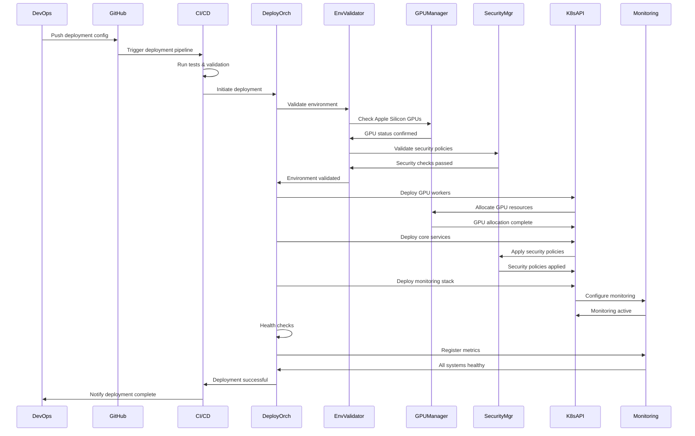

# Gordon Gekko Production Deployment Architecture Diagrams

## Overview

This document contains comprehensive system diagrams for the Gordon Gekko autonomous trading system's production deployment architecture, specifically optimized for Apple Silicon M1/M2 processors with multi-GPU support.

## Architecture Legend

```
┌─────────────┐    ┌─────────────┐    ┌─────────────┐
│ Service     │───▶│   API       │    │   Queue     │
│ Component   │    │  Gateway    │    │   Topic     │
└─────────────┘    └─────────────┘    └─────────────┘
       │                     │              │
       ▼                     ▼              ▼
┌─────────────┐    ┌─────────────┐    ┌─────────────┐
│  Database   │    │   Cache     │    │   Storage   │
└─────────────┘    └─────────────┘    └─────────────┘

[Component] = Stateless Service
{Component} = Stateful Service
+Component+ = Critical Service
*Component* = External System
```

## 1. High-Level Deployment Architecture

```
┌─────────────────────────────────────────────────────────────────────────────────────────┐
│                                    External Systems                                    │
├─────────────────────────────────────────────────────────────────────────────────────────┤
│  *Trading Platforms*      *ML Services*        *Monitoring*        *Security*           │
│  • Coinbase Pro           • OpenRouter          • Prometheus        • SIEM Systems      │
│  • Binance.US             • LiteLLM             • Grafana           • IDS/IPS           │
│  • OANDA                   • Custom Models       • ELK Stack         • Compliance Tools  │
│  • Market Data Feeds      • NHITS/NBEATSx       • Jaeger            • Audit Systems     │
│                           • ruv-FANN Core       • Custom Metrics    • Key Management    │
└─────────────────────────────────────────────────────────────────────────────────────────┘
                                                     │
                                                     ▼
┌─────────────────────────────────────────────────────────────────────────────────────────┐
│                               Multi-Region Kubernetes Clusters                          │
├─────────────────────────────────────────────────────────────────────────────────────────┤
│  ┌─────────────┐  ┌─────────────┐  ┌─────────────┐  ┌─────────────┐  ┌─────────────┐    │
│  │  Region 1   │  │  Region 2   │  │  Region 3   │  │  Region 4   │  │  Region 5   │    │
│  │ (US-East)  │  │ (US-West)  │  │  (EU-West) │  │  (AP-SW)   │  │  (US-Ctrl) │    │
│  │             │  │             │  │             │  │             │  │             │    │
│  │ • Primary   │  • Secondary │  • DR Site   │  • Load      │  • Control   │    │
│  │   Trading   │    Trading  │  • Backup   │    Balancer │    Plane    │    │
│  │   Cluster   │    Cluster  │  • Recovery │  • Global    │  • K8s API   │    │
│  │ • Apple     │  • Apple     │  • Apple    │    Traffic  │  • Etcd      │    │
│  │   Silicon   │    Silicon  │    Silicon │  • Health     │  • Secrets   │    │
│  │   GPU       │    GPU      │    GPU    │    Checks   │  • Policies  │    │
│  │   Workers   │    Workers  │    Workers │  • Failover  │             │    │
│  └─────────────┘  └─────────────┘  └─────────────┘  └─────────────┘  └─────────────┘    │
│                                                                                         │
│  ┌───────────────────────────────────────────────────────────────────────────────────┐    │
│  │                                 Service Mesh Layer                               │    │
│  ├───────────────────────────────────────────────────────────────────────────────────┤    │
│  │  ┌─────────────┐  ┌─────────────┐  ┌─────────────┐  ┌─────────────┐              │    │
│  │  │  Security   │  │  Traffic    │  │ Observability│  │  Policy     │              │    │
│  │  │  Service    │  │ Management  │  │   Service    │  │ Enforcement │              │    │
│  │  │             │  │             │  │              │  │             │              │    │
│  │  │ • mTLS      │  • Load       │  • Metrics    │  • RBAC      │              │    │
│  │  │ • JWT       │    Balancing │  • Tracing    │  • ABAC      │              │    │
│  │  │ • Identity  │  • Circuit    │  • Logging    │  • Rate      │              │    │
│  │  │   Provider  │    Breaker   │  • Events     │    Limits   │              │    │
│  │  │ • Cert      │  • Rate       │  • Alerts     │  • Network   │              │    │
│  │  │   Manager   │    Limits    │              │    Policies │              │    │
│  │  └─────────────┘  └─────────────┘  └─────────────┘  └─────────────┘              │    │
│  └───────────────────────────────────────────────────────────────────────────────────┘    │
└─────────────────────────────────────────────────────────────────────────────────────────┘
                                                     │
                                                     ▼
┌─────────────────────────────────────────────────────────────────────────────────────────┐
│                               Gordon Gekko Core Services                               │
├─────────────────────────────────────────────────────────────────────────────────────────┤
│  ┌─────────────┐  ┌─────────────┐  ┌─────────────┐  ┌─────────────┐  ┌─────────────┐    │
│  │Deployment   │  │  GPU        │  │ Security    │  │ Monitoring  │  │ Trading     │    │
│  │Orchestrator │  │  Manager    │  │  Manager    │  │  Manager    │  │  Core       │    │
│  │             │  │             │  │             │  │             │  │             │    │
│  │• Deployment │  • Apple      │  • Zero-     │  • Metrics   │  • Strategy  │    │
│  │  Lifecycle  │    Silicon   │    Trust    │    Collection│    Engine   │    │
│  │• Rollback   │    MPS/CUDA  │  • RBAC      │  • Alerting  │  • Risk      │    │
│  │• Health     │  • Resource   │  • Audit     │  • Dashboard │    Mgmt     │    │
│  │  Checks     │    Mgmt      │    Logs      │  • Reporting │  • Order     │    │
│  └─────────────┘  └─────────────┘  └─────────────┘  └─────────────┘  └─────────────┘    │
└─────────────────────────────────────────────────────────────────────────────────────────┘
```

## 2. Apple Silicon GPU Cluster Architecture

### GPU Resource Management Diagram

```
┌─────────────────────────────────────────────────────────────────────────────────────────┐
│                              Apple Silicon GPU Cluster                                 │
├─────────────────────────────────────────────────────────────────────────────────────────┤
│  ┌─────────────────────────────────────────────────────────────────────────────────┐    │
│  │                           GPU Resource Manager                                 │    │
│  ├─────────────────────────────────────────────────────────────────────────────────┤    │
│  │  ┌─────────────┐  ┌─────────────┐  ┌─────────────┐  ┌─────────────┐             │    │
│  │  │ Allocation  │  │  Load       │  │ Performance │  │  Health     │             │    │
│  │  │  Controller │  │ Balancer    │  │  Monitor    │  │  Checker    │             │    │
│  │  │             │  │             │  │             │  │             │             │    │
│  │  │ • MPS       │  • Round-    │  • GPU       │  • Heartbeat │             │    │
│  │  │   Memory    │    Robin    │    Memory   │  • Resource  │             │    │
│  │  │   Pool      │  • Priority  │    Usage    │    Status   │             │    │
│  │  │ • CUDA      │    Queue    │  • Model     │  • Error     │             │    │
│  │  │   Memory    │  • Model     │    Load     │    Alerts   │             │    │
│  │  │   Pool      │    Size     │  • Inference │             │             │    │
│  │  │ • Model     │             │    Time     │             │             │    │
│  │  │   Registry  │             │  • Thermal   │             │             │    │
│  │  └─────────────┘  └─────────────┘  └─────────────┘  └─────────────┘             │    │
│  └─────────────────────────────────────────────────────────────────────────────────┘    │
│                                                                                         │
│  ┌─────────────────────────────────────────────────────────────────────────────────┐    │
│  │                          Apple Silicon GPU Workers                             │    │
│  ├─────────────────────────────────────────────────────────────────────────────────┤    │
│  │  ┌─────────────┐  ┌─────────────┐  ┌─────────────┐  ┌─────────────┐             │    │
│  │  │  M1/M2      │  │  M1/M2      │  │  M1/M2      │  │  M1/M2      │             │    │
│  │  │  GPU Worker │  │  GPU Worker │  │  GPU Worker │  │  GPU Worker │             │    │
│  │  │    #1       │  │    #2       │  │    #3       │  │    #4       │             │    │
│  │  │             │  │             │  │             │  │             │             │    │
│  │  │ • MPS Core  │  • MPS Core  │  • MPS Core  │  • MPS Core  │             │    │
│  │  │ • CUDA      │  • CUDA      │  • CUDA      │  • CUDA      │             │    │
│  │  │   Bridge    │    Bridge   │    Bridge   │    Bridge   │             │    │
│  │  │ • Model     │  • Model     │  • Model     │  • Model     │             │    │
│  │  │   Server    │    Server   │    Server   │    Server   │             │    │
│  │  │ • Metrics   │  • Metrics   │  • Metrics   │  • Metrics   │             │    │
│  │  │   Exporter  │    Exporter │    Exporter │    Exporter │             │    │
│  │  └─────────────┘  └─────────────┘  └─────────────┘  └─────────────┘             │    │
│  └─────────────────────────────────────────────────────────────────────────────────┘    │
└─────────────────────────────────────────────────────────────────────────────────────────┘
```

### GPU Memory Architecture

```
┌─────────────────────────────────────────────────────────────────────────────────────────┐
│                               GPU Memory Management                                    │
├─────────────────────────────────────────────────────────────────────────────────────────┤
│  ┌─────────────────────────────────────────────────────────────────────────────────┐    │
│  │                          Unified Memory Architecture                            │    │
│  ├─────────────────────────────────────────────────────────────────────────────────┤    │
│  │  ┌─────────────┐  ┌─────────────┐  ┌─────────────┐  ┌─────────────┐             │    │
│  │  │   MPS       │  │   CUDA      │  │   Model     │  │   Shared    │             │    │
│  │  │   Memory    │  │   Memory    │  │   Memory    │  │   Memory    │             │    │
│  │  │   Pool      │  │   Pool      │  │   Pool      │  │   Pool      │             │    │
│  │  │             │  │             │  │             │  │             │             │    │
│  │  │ • NHITS     │  • NBEATSx   │  • ruv-FANN  │  • Training  │             │    │
│  │  │   Models    │    Models   │    Models   │    Data     │             │    │
│  │  │ • Inference │  • Inference │  • Inference │  • Batch     │             │    │
│  │  │   Cache     │    Cache    │    Cache    │    Jobs     │             │    │
│  │  │ • Gradients │  • Gradients │  • Embeddings│  • Results   │             │    │
│  │  │ • Optimizers│  • Optimizers│  • Attention │             │             │    │
│  │  └─────────────┘  └─────────────┘  └─────────────┘  └─────────────┘             │    │
│  └─────────────────────────────────────────────────────────────────────────────────┘    │
│                                                                                         │
│  ┌─────────────────────────────────────────────────────────────────────────────────┐    │
│  │                          Memory Management Policies                             │    │
│  ├─────────────────────────────────────────────────────────────────────────────────┤    │
│  │  ┌─────────────┐  ┌─────────────┐  ┌─────────────┐  ┌─────────────┐             │    │
│  │  │  Pre-       │  │  Dynamic    │  │  Memory     │  │  Garbage    │             │    │
│  │  │ allocation  │  │ Allocation  │  │ Defrag-     │  │ Collection  │             │    │
│  │  │             │  │             │  │ mentation   │  │             │             │    │
│  │  │ • Model     │  • On-demand │  • Compaction│  • Automatic │             │    │
│  │  │   Loading   │  • Batch     │  • Coalescing│  • Cleanup   │             │    │
│  │  │ • Memory    │    Jobs     │  • Hole      │  • Unused    │             │    │
│  │  │   Warmup    │  • Large     │    Filling  │    Models   │             │    │
│  │  │ • Cache     │    Models   │  • Reclaim   │  • Gradients │             │    │
│  │  │   Prefetch  │  • Inference │    Space    │  • Optimizers│             │    │
│  │  └─────────────┘  └─────────────┘  └─────────────┘  └─────────────┘             │    │
│  └─────────────────────────────────────────────────────────────────────────────────┘    │
└─────────────────────────────────────────────────────────────────────────────────────────┘
```

## 3. Zero-Trust Security Architecture

### Service Mesh Security Diagram

```
┌─────────────────────────────────────────────────────────────────────────────────────────┐
│                               Zero-Trust Security Model                                │
├─────────────────────────────────────────────────────────────────────────────────────────┤
│  ┌─────────────────────────────────────────────────────────────────────────────────┐    │
│  │                           Identity & Access Management                          │    │
│  ├─────────────────────────────────────────────────────────────────────────────────┤    │
│  │  ┌─────────────┐  ┌─────────────┐  ┌─────────────┐  ┌─────────────┐             │    │
│  │  │   Service   │  │   User      │  │  Certificate │  │  Policy     │             │    │
│  │  │  Identity   │  │  Identity   │  │  Authority   │  │  Engine     │             │    │
│  │  │             │  │             │  │             │  │             │             │    │
│  │  │ • SPIFFE    │  • JWT       │  • mTLS      │  • OPA       │             │    │
│  │  │   IDs       │    Tokens   │    Certs    │    Policies │             │    │
│  │  │ • Service   │  • MFA       │  • Auto      │  • RBAC      │             │    │
│  │  │   Accounts  │  • Session   │    Rotation  │  • ABAC      │             │    │
│  │  │ • Workload  │    Mgmt     │  • Short     │  • Context-  │             │    │
│  │  │   IDs       │  • Claims    │    TTL      │    Aware    │             │    │
│  │  └─────────────┘  └─────────────┘  └─────────────┘  └─────────────┘             │    │
│  └─────────────────────────────────────────────────────────────────────────────────┘    │
│                                                                                         │
│  ┌─────────────────────────────────────────────────────────────────────────────────┐    │
│  │                             Network Security Controls                           │    │
│  ├─────────────────────────────────────────────────────────────────────────────────┤    │
│  │  ┌─────────────┐  ┌─────────────┐  ┌─────────────┐  ┌─────────────┐             │    │
│  │  │  Micro-     │  │  Traffic    │  │  Encryption  │  │  Intrusion  │             │    │
│  │  │ segmentation│  │  Control    │  │  Service    │  │  Detection  │             │    │
│  │  │             │  │             │  │             │  │             │             │    │
│  │  │ • Namespace │  • Rate      │  • TLS 1.3   │  • Behavioral│             │    │
│  │  │   Isolation │    Limiting │  • mTLS      │    Analysis │             │    │
│  │  │ • Network   │  • WAF       │  • Field     │  • Anomaly   │             │    │
│  │  │   Policies  │  • API       │    Level    │    Detection│             │    │
│  │  │ • Service   │    Gateway  │  • Data      │  • Threat    │             │    │
│  │  │   Mesh      │  • Circuit   │    Masking  │    Intel    │             │    │
│  │  │   Rules     │    Breaker  │  • Token-    │             │             │    │
│  │  │             │             │    ization  │             │             │    │
│  │  └─────────────┘  └─────────────┘  └─────────────┘  └─────────────┘             │    │
│  └─────────────────────────────────────────────────────────────────────────────────┘    │
│                                                                                         │
│  ┌─────────────────────────────────────────────────────────────────────────────────┐    │
│  │                              Runtime Security                                   │    │
│  │  ┌─────────────┐  ┌─────────────┐  ┌─────────────┐  ┌─────────────┐             │    │
│  │  │ Continuous  │  │  Behavioral │  │  Security   │  │  Audit &    │             │    │
│  │  │ Verification│  │  Analysis   │  │  Events     │  │ Compliance  │             │    │
│  │  │             │  │             │  │             │  │             │             │    │
│  │  │ • Policy    │  • Baseline  │  • SIEM      │  • SOX       │             │    │
│  │  │   Checks    │    Profiling│  • Real-time │  • GDPR      │             │    │
│  │  │ • Anomaly   │  • Threat    │    Alerts   │  • PCI DSS   │             │    │
│  │  │   Detection │    Scoring  │  • Automated │  • FINRA     │             │    │
│  │  │ • Runtime   │  • Risk      │    Response │  • SEC       │             │    │
│  │  │   Auth      │    Models   │  • SOAR      │  • Audit     │             │    │
│  │  │ • Context   │  • ML-based  │    Playbooks│    Trails   │             │    │
│  │  │   Aware     │    Detection│             │  • Reports   │             │    │
│  │  └─────────────┘  └─────────────┘  └─────────────┘  └─────────────┘             │    │
└─────────────────────────────────────────────────────────────────────────────────────────┘
```

## 4. Multi-Region Deployment Architecture

### Global Traffic Management

```
┌─────────────────────────────────────────────────────────────────────────────────────────┐
│                           Global Traffic Management                                    │
├─────────────────────────────────────────────────────────────────────────────────────────┤
│  ┌─────────────────────────────────────────────────────────────────────────────────┐    │
│  │                                 Geo-DNS Resolution                              │    │
│  ├─────────────────────────────────────────────────────────────────────────────────┤    │
│  │  ┌─────────────┐  ┌─────────────┐  ┌─────────────┐  ┌─────────────┐             │    │
│  │  │  Global     │  │  Latency-   │  │  Health-    │  │  Load       │             │    │
│  │  │  Load       │  │  Based      │  │  Based      │  │  Balancing  │             │    │
│  │  │  Balancer   │  │  Routing    │  │  Routing    │  │  Service    │             │    │
│  │  │             │  │             │  │             │  │             │             │    │
│  │  │ • AWS GLB   │  • Route53    │  • Active-   │  • K8s       │             │    │
│  │  │ • GCP GLB   │  • Traffic    │    Active   │    Services │             │    │
│  │  │ • Azure     │    Manager  │  • Passive   │  • Istio     │             │    │
│  │  │   Front     │  • Geo-      │    Health   │    Gateway  │             │    │
│  │  │   Door      │    Proximity│    Checks   │  • Envoy     │             │    │
│  │  │ • Multi-    │  • Weighted  │  • Circuit   │    Proxy    │             │    │
│  │  │   Cloud     │    Routing  │    Breakers │             │             │    │
│  │  └─────────────┘  └─────────────┘  └─────────────┘  └─────────────┘             │    │
│  └─────────────────────────────────────────────────────────────────────────────────┘    │
│                                                                                         │
│  ┌─────────────────────────────────────────────────────────────────────────────────┐    │
│  │                              Regional Clusters                                  │    │
│  ├─────────────────────────────────────────────────────────────────────────────────┤    │
│  │  ┌─────────────┐  ┌─────────────┐  ┌─────────────┐  ┌─────────────┐             │    │
│  │  │  US-East    │  │  US-West    │  │  EU-West    │  │  AP-SW      │             │    │
│  │  │  Region     │  │  Region     │  │  Region     │  │  Region     │             │    │
│  │  │             │  │             │  │             │  │             │             │    │
│  │  │ • 3 AZs     │  • 2 AZs     │  • 3 AZs     │  • 2 AZs     │             │    │
│  │  │ • Apple     │  • Apple     │  • Apple     │  • Apple     │             │    │
│  │  │   Silicon   │    Silicon  │    Silicon  │    Silicon  │             │    │
│  │  │   GPU       │    GPU      │    GPU      │    GPU      │             │    │
│  │  │   Workers   │    Workers  │    Workers  │    Workers  │             │    │
│  │  │ • Primary   │  • Secondary │  • Backup    │  • Read-     │             │    │
│  │  │   Trading   │    Trading  │    Trading  │    only     │             │    │
│  │  │   Services  │    Services │    Services │    Services │             │    │
│  │  └─────────────┘  └─────────────┘  └─────────────┘  └─────────────┘             │    │
│  └─────────────────────────────────────────────────────────────────────────────────┘    │
│                                                                                         │
│  ┌─────────────────────────────────────────────────────────────────────────────────┐    │
│  │                           Cross-Region Data Replication                         │    │
│  ├─────────────────────────────────────────────────────────────────────────────────┤    │
│  │  ┌─────────────┐  ┌─────────────┐  ┌─────────────┐  ┌─────────────┐             │    │
│  │  │  Database   │  │  Message    │  │  File       │  │  Cache      │             │    │
│  │  │  Replication│  │  Queue      │  │  Storage    │  │  Replication│             │    │
│  │  │             │  │  Replication│  │  Replication│  │             │             │    │
│  │  │ • Multi-    │  • Kafka     │  • S3        │  • Redis     │             │    │
│  │  │   Master    │    Mirror-   │    Cross-   │    Cluster  │             │    │
│  │  │ • Read      │    Maker    │    Region   │    Replica  │             │    │
│  │  │   Replicas  │  • Event      │  • Multi-    │  • Global    │             │    │
│  │  │ • Witness    │    Sourcing │    Part     │    Read     │             │    │
│  │  │   Nodes     │  • Topic      │    Replica  │    Routing  │             │    │
│  │  │ • Auto      │    Replicas │  • CDC       │             │             │    │
│  │  │   Failover  │             │             │             │             │    │
│  │  └─────────────┘  └─────────────┘  └─────────────┘  └─────────────┘             │    │
└─────────────────────────────────────────────────────────────────────────────────────────┘
```

## 5. Data Flow Architecture

### Real-Time Data Processing Pipeline

```
┌─────────────────────────────────────────────────────────────────────────────────────────┐
│                           Real-Time Data Processing Pipeline                           │
├─────────────────────────────────────────────────────────────────────────────────────────┤
│  ┌─────────────────────────────────────────────────────────────────────────────────┐    │
│  │                           External Data Sources                                │    │
│  ├─────────────────────────────────────────────────────────────────────────────────┤    │
│  │  ┌─────────────┐  ┌─────────────┐  ┌─────────────┐  ┌─────────────┐             │    │
│  │  │ Trading     │  │ Market      │  │ News &      │  │ Social      │             │    │
│  │  │ Platforms   │  │ Data        │  │ Sentiment   │  │ Media       │             │    │
│  │  │             │  │ Providers   │  │ APIs        │  │ APIs        │             │    │
│  │  │ • Coinbase  │  • Real-time  │  • NewsAPI   │  • Twitter   │             │    │
│  │  │   Pro       │    Price    │  • Alpha      │    API      │             │    │
│  │  │ • Binance   │    Feeds    │    Vantage  │  • Reddit    │             │    │
│  │  │   .US       │  • Order     │  • Sentiment │    API      │             │    │
│  │  │ • OANDA     │    Books    │    Analysis │  • StockTwits│             │    │
│  │  │ • FIX       │  • Market    │  • Social    │             │             │    │
│  │  │   Protocol  │    Depth    │    Media    │             │             │    │
│  │  └─────────────┘  └─────────────┘  └─────────────┘  └─────────────┘             │    │
│  └─────────────────────────────────────────────────────────────────────────────────┘    │
│                                                                                         │
│  ┌─────────────────────────────────────────────────────────────────────────────────┐    │
│  │                             Data Ingestion Layer                                │    │
│  ├─────────────────────────────────────────────────────────────────────────────────┤    │
│  │  ┌─────────────┐  ┌─────────────┐  ┌─────────────┐  ┌─────────────┐             │    │
│  │  │  WebSocket  │  │  REST API   │  │  Message    │  │  Streaming  │             │    │
│  │  │  Ingestion  │  │  Polling    │  │  Queue      │  │  Data       │             │    │
│  │  │             │  │             │  │  Ingestion  │  │  Processor  │             │    │
│  │  │ • Real-time │  • Batch     │  • Kafka     │  • Spark     │             │    │
│  │  │   Streams   │    Import   │    Connect  │    Streaming│             │    │
│  │  │ • Auto-     │  • Rate      │  • RabbitMQ  │  • Flink     │             │    │
│  │  │   reconnect │    Limit    │  • Pulsar    │  • Apple     │             │    │
│  │  │ • Message   │    Handling │  • SQS       │    Silicon  │             │    │
│  │  │   Ordering  │  • Retry     │  • Kinesis   │    GPU      │             │    │
│  │  │ • Dedup     │    Logic    │             │    Accel    │             │    │
│  │  └─────────────┘  └─────────────┘  └─────────────┘  └─────────────┘             │    │
│  └─────────────────────────────────────────────────────────────────────────────────┘    │
│                                                                                         │
│  ┌─────────────────────────────────────────────────────────────────────────────────┐    │
│  │                            Stream Processing Engine                             │    │
│  ├─────────────────────────────────────────────────────────────────────────────────┤    │
│  │  ┌─────────────┐  ┌─────────────┐  ┌─────────────┐  ┌─────────────┐             │    │
│  │  │  Data       │  │  Signal     │  │  Risk       │  │  Portfolio  │             │    │
│  │  │  Validation │  │  Generation │  │  Analysis   │  │  Optimizer  │             │    │
│  │  │             │  │             │  │             │  │             │             │    │
│  │  │ • Schema    │  • ML Model  │  • VaR       │  • Position  │             │    │
│  │  │   Validation│    Inference│    Calculat │    Sizing   │             │    │
│  │  │ • Quality   │  • NHITS/    │  • Stress    │  • Re-       │             │    │
│  │  │   Checks   │    NBEATSx  │    Tests    │    balancing│             │    │
│  │  │ • Anomaly   │  • ruv-FANN  │  • Position  │  • P&L      │             │    │
│  │  │   Detection │    Models   │    Limits   │    Tracking │             │    │
│  │  │ • Rate      │  • Confidence│  • Exposure  │  • Cash     │             │    │
│  │  │   Limiting  │    Scoring  │    Analysis │    Mgmt     │             │    │
│  │  └─────────────┘  └─────────────┘  └─────────────┘  └─────────────┘             │    │
│  └─────────────────────────────────────────────────────────────────────────────────┘    │
│                                                                                         │
│  ┌─────────────────────────────────────────────────────────────────────────────────┐    │
│  │                             Order Execution Engine                              │    │
│  ├─────────────────────────────────────────────────────────────────────────────────┤    │
│  │  ┌─────────────┐  ┌─────────────┐  ┌─────────────┐  ┌─────────────┐             │    │
│  │  │  Smart      │  │  Execution  │  │  Position   │  │  Settlement │             │    │
│  │  │  Order      │  │  Algorithm  │  │  Management │  │  Processor  │             │    │
│  │  │  Router     │  │             │  │             │  │             │             │    │
│  │  │ • Multi-    │  • TWAP      │  • Real-time │  • FIX       │             │    │
│  │  │   Platform  │  • VWAP      │    P&L      │    Protocol │             │    │
│  │  │   Routing   │  • Iceberg   │  • Position  │  • SWIFT     │             │    │
│  │  │ • Best      │  • Volume    │    Updates  │  • Payment   │             │    │
│  │  │   Execution │    Weighted │  • Risk      │    Systems  │             │    │
│  │  │ • Dark      │  • Time      │    Limits   │  • Block-    │             │    │
│  │  │   Pool      │    Weighted │  • Portfolio │    chain    │             │    │
│  │  │   Access    │  • Adaptive  │    Rebal    │             │             │    │
│  │  └─────────────┘  └─────────────┘  └─────────────┘  └─────────────┘             │    │
└─────────────────────────────────────────────────────────────────────────────────────────┘
```

## 6. Monitoring and Observability Architecture

### Comprehensive Monitoring Stack

```
┌─────────────────────────────────────────────────────────────────────────────────────────┐
│                           Monitoring & Observability Stack                             │
├─────────────────────────────────────────────────────────────────────────────────────────┤
│  ┌─────────────────────────────────────────────────────────────────────────────────┐    │
│  │                                Metrics Collection                              │    │
│  ├─────────────────────────────────────────────────────────────────────────────────┤    │
│  │  ┌─────────────┐  ┌─────────────┐  ┌─────────────┐  ┌─────────────┐             │    │
│  │  │  System     │  │ Application │  │  Business   │  │  Custom     │             │    │
│  │  │  Metrics    │  │  Metrics    │  │  Metrics    │  │  Metrics    │             │    │
│  │  │             │  │             │  │             │  │             │             │    │
│  │  │ • CPU/Memory│  • Request   │  • Trading   │  • GPU       │             │    │
│  │  │ • Disk I/O  │    Latency  │    Volume   │    Memory   │             │    │
│  │  │ • Network   │  • Error     │  • P&L       │    Usage    │             │    │
│  │  │ • Process   │    Rates    │    Metrics  │  • Model     │             │    │
│  │  │   Health    │  • Throughput│  • Risk      │    Load     │             │    │
│  │  │ • Container │  • Queue     │    Exposure │  • Inference │             │    │
│  │  │   Metrics   │    Depth    │  • Position  │    Latency  │             │    │
│  │  └─────────────┘  └─────────────┘  └─────────────┘  └─────────────┘             │    │
│  └─────────────────────────────────────────────────────────────────────────────────┘    │
│                                                                                         │
│  ┌─────────────────────────────────────────────────────────────────────────────────┐    │
│  │                                Log Aggregation                                  │    │
│  ├─────────────────────────────────────────────────────────────────────────────────┤    │
│  │  ┌─────────────┐  ┌─────────────┐  ┌─────────────┐  ┌─────────────┐             │    │
│  │  │ Application │  │  Security   │  │  Audit      │  │  System     │             │    │
│  │  │  Logs       │  │  Logs       │  │  Logs       │  │  Logs       │             │    │
│  │  │             │  │             │  │             │  │             │             │    │
│  │  │ • Request   │  • Auth      │  • Trading   │  • Service   │             │    │
│  │  │   Logs      │    Events   │    Activity │    Health   │             │    │
│  │  │ • Error     │  • Security  │  • Order     │  • Resource  │             │    │
│  │  │   Logs      │    Alerts   │    History  │    Usage    │             │    │
│  │  │ • Debug     │  • Access    │  • Compliance│  • Performance│            │    │
│  │  │   Logs      │    Logs     │    Events   │  • Errors    │             │    │
│  │  │ • Trade     │  • Anomaly   │  • Position  │             │             │    │
│  │  │   Logs      │    Detection│    Changes  │             │             │    │
│  │  └─────────────┘  └─────────────┘  └─────────────┘  └─────────────┘             │    │
│  └─────────────────────────────────────────────────────────────────────────────────┘    │
│                                                                                         │
│  ┌─────────────────────────────────────────────────────────────────────────────────┐    │
│  │                              Distributed Tracing                                │    │
│  ├─────────────────────────────────────────────────────────────────────────────────┤    │
│  │  ┌─────────────┐  ┌─────────────┐  ┌─────────────┐  ┌─────────────┐             │    │
│  │  │  Service    │  │  Cross-     │  │  Performance│  │  Error      │             │    │
│  │  │  Traces     │  │  Service    │  │  Traces     │  │  Traces     │             │    │
│  │  │             │  │  Traces     │  │             │  │             │             │    │
│  │  │ • API       │  • Data      │  • Latency   │  • Exception │             │    │
│  │  │   Calls     │    Flow     │    Analysis │    Tracking │             │    │
│  │  │ • Database  │  • Message   │  • Bottleneck│  • Root      │             │    │
│  │  │   Queries   │    Routing  │    Detection│    Cause    │             │    │
│  │  │ • External  │  • Event     │  • Resource  │    Analysis │             │    │
│  │  │   API Calls │    Chain    │    Usage    │  • Stack     │             │    │
│  │  │ • GPU       │  • Workflow  │  • GPU       │    Traces   │             │    │
│  │  │   Kernel    │    Traces   │    Profiling│             │             │    │
│  │  └─────────────┘  └─────────────┘  └─────────────┘  └─────────────┘             │    │
└─────────────────────────────────────────────────────────────────────────────────────────┘
```

### Alerting and Incident Management

```
┌─────────────────────────────────────────────────────────────────────────────────────────┐
│                           Alerting & Incident Management                               │
├─────────────────────────────────────────────────────────────────────────────────────────┤
│  ┌─────────────────────────────────────────────────────────────────────────────────┐    │
│  │                                Alert Rules Engine                              │    │
│  ├─────────────────────────────────────────────────────────────────────────────────┤    │
│  │  ┌─────────────┐  ┌─────────────┐  ┌─────────────┐  ┌─────────────┐             │    │
│  │  │ Critical    │  │ Warning     │  │ Info        │  │ Predictive  │             │    │
│  │  │ Alerts      │  │ Alerts      │  │ Alerts      │  │ Alerts      │             │    │
│  │  │             │  │             │  │             │  │             │             │    │
│  │  │ • Service   │  • Performance│  • Scaling   │  • Resource  │             │    │
│  │  │   Down      │    Degrada- │    Events   │    Usage    │             │    │
│  │  │ • Security  │    tion     │  • Config    │    Trends   │             │    │
│  │  │   Breach    │  • Resource  │    Changes  │  • Performance│            │    │
│  │  │ • Trading   │    Usage    │  • Deploy-   │    Patterns │             │    │
│  │  │   Halt      │    Threshold│    ment     │  • Anomaly   │             │    │
│  │  │ • Risk      │  • Queue     │    Events   │    Detection│             │    │
│  │  │   Limit     │    Depth    │             │             │             │    │
│  │  │   Breach    │  • Error     │             │             │             │    │
│  │  └─────────────┘  └─────────────┘  └─────────────┘  └─────────────┘             │    │
│  └─────────────────────────────────────────────────────────────────────────────────┘    │
│                                                                                         │
│  ┌─────────────────────────────────────────────────────────────────────────────────┐    │
│  │                            Notification Channels                                │    │
│  ├─────────────────────────────────────────────────────────────────────────────────┤    │
│  │  ┌─────────────┐  ┌─────────────┐  ┌─────────────┐  ┌─────────────┐             │    │
│  │  │ Immediate   │  │ Team        │  │ Management  │  │ External    │             │    │
│  │  │ Response    │  │ Collab      │  │ Reporting   │  │ Systems     │             │    │
│  │  │             │  │             │  │             │  │             │             │    │
│  │  │ • PagerDuty │  • Slack     │  • Email     │  • SIEM      │             │    │
│  │  │ • OpsGenie  │  • Teams     │  • Dashboard │  • SOAR      │             │    │
│  │  │ • Phone     │  • Webhook   │  • Reports   │  • ITSM      │             │    │
│  │  │   Alerts    │  • ChatOps   │  • KPI       │  • Ticketing │             │    │
│  │  │ • SMS       │  • Incident  │    Reports  │    Systems  │             │    │
│  │  │   Alerts    │    Channels │             │             │             │    │
│  │  └─────────────┘  └─────────────┘  └─────────────┘  └─────────────┘             │    │
│  └─────────────────────────────────────────────────────────────────────────────────┘    │
│                                                                                         │
│  ┌─────────────────────────────────────────────────────────────────────────────────┐    │
│  │                           Incident Response Process                             │    │
│  ├─────────────────────────────────────────────────────────────────────────────────┤    │
│  │  ┌─────────────┐  ┌─────────────┐  ┌─────────────┐  ┌─────────────┐             │    │
│  │  │ Detection   │  │ Triage      │  │ Response    │  │ Recovery    │             │    │
│  │  │ & Alert     │  │ & Analysis  │  │ & Resolution│  │ & Learning  │             │    │
│  │  │             │  │             │  │             │  │             │             │    │
│  │  │ • Monitor-  │  • Impact    │  • Auto-     │  • Post-     │             │    │
│  │  │   ing      │    Assess   │    matic    │    mortem   │             │    │
│  │  │   Systems   │  • Priority  │    Remedia- │  • Lessons   │             │    │
│  │  │ • Alert     │    Setting  │    tion     │    Learned  │             │    │
│  │  │   Rules     │  • Stake-    │  • Manual    │  • Process   │             │    │
│  │  │ • Anomaly   │    holder   │    Inter-   │    Improve- │             │    │
│  │  │   Detection │    Notif    │    vention  │    ment     │             │    │
│  │  │ • Log       │  • Escalation│  • Communi- │  • Docu-     │             │    │
│  │  │   Analysis  │    Process  │    cation   │    mentation│             │    │
│  │  └─────────────┘  └─────────────┘  └─────────────┘  └─────────────┘             │    │
└─────────────────────────────────────────────────────────────────────────────────────────┘
```

## 7. Deployment Sequence Diagram

### Production Deployment Workflow



## 8. Service Communication Patterns

### Inter-Service Communication

```
┌─────────────────────────────────────────────────────────────────────────────────────────┐
│                           Inter-Service Communication Patterns                         │
├─────────────────────────────────────────────────────────────────────────────────────────┤
│  ┌─────────────────────────────────────────────────────────────────────────────────┐    │
│  │                            Synchronous Communication                            │    │
│  ├─────────────────────────────────────────────────────────────────────────────────┤    │
│  │  ┌─────────────┐  ┌─────────────┐  ┌─────────────┐  ┌─────────────┐             │    │
│  │  │  REST APIs  │  │  gRPC       │  │  GraphQL    │  │  WebSocket  │             │    │
│  │  │             │  │  Calls      │  │  Queries    │  │  Streams    │             │    │
│  │  │ • HTTP/1.1  │  • Binary    │  • Typed     │  • Real-time │             │    │
│  │  │ • HTTP/2    │    Protocol  │    Schema   │    Data     │             │    │
│  │  │ • JSON      │  • ProtoBuf  │  • Flexible  │  • Bi-       │             │    │
│  │  │ • XML       │  • Efficient │    Queries  │    directional│            │    │
│  │  │ • Rate      │  • Streaming │  • Sub-      │  • Event     │             │    │
│  │  │   Limiting  │  • Bi-       │    scriptions│    Driven   │             │    │
│  │  │ • Caching   │    directional│             │             │             │    │
│  │  └─────────────┘  └─────────────┘  └─────────────┘  └─────────────┘             │    │
│  └─────────────────────────────────────────────────────────────────────────────────┘    │
│                                                                                         │
│  ┌─────────────────────────────────────────────────────────────────────────────────┐    │
│  │                           Asynchronous Communication                            │    │
│  ├─────────────────────────────────────────────────────────────────────────────────┤    │
│  │  ┌─────────────┐  ┌─────────────┐  ┌─────────────┐  ┌─────────────┐             │    │
│  │  │  Message    │  │  Event      │  │  Stream     │  │  Queue      │             │    │
│  │  │  Queues     │  │  Streaming  │  │  Processing │  │  Systems    │             │    │
│  │  │             │  │             │  │             │  │             │             │    │
│  │  │ • RabbitMQ  │  • Kafka     │  • Apache    │  • Redis     │             │    │
│  │  │ • SQS       │  • Pulsar    │    Spark    │    Streams  │             │    │
│  │  │ • Kinesis   │  • NATS      │  • Apache    │  • Apache    │             │    │
│  │  │ • Azure     │  • Google    │    Flink    │    Kafka    │             │    │
│  │  │   Queue     │    Pub/Sub  │  • Apple     │    Streams  │             │    │
│  │  │ • GCP       │  • AWS SNS/  │    Silicon  │  • Pulsar    │             │    │
│  │  │   Pub/Sub   │    SQS      │    GPU      │    Functions │             │    │
│  │  └─────────────┘  └─────────────┘  └─────────────┘  └─────────────┘             │    │
│  └─────────────────────────────────────────────────────────────────────────────────┘    │
│                                                                                         │
│  ┌─────────────────────────────────────────────────────────────────────────────────┐    │
│  │                           Communication Security                                │    │
│  ├─────────────────────────────────────────────────────────────────────────────────┤    │
│  │  ┌─────────────┐  ┌─────────────┐  ┌─────────────┐  ┌─────────────┐             │    │
│  │  │  mTLS       │  │  API        │  │  Message    │  │  Network    │             │    │
│  │  │  Encryption │  │  Gateway    │  │  Encryption │  │  Policies   │             │    │
│  │  │             │  │             │  │             │  │             │             │    │
│  │  │ • Mutual    │  • Rate      │  • End-to-   │  • Service   │             │    │
│  │  │   TLS       │    Limiting │    End      │    Mesh     │             │    │
│  │  │ • Certificate│  • WAF       │    Encryption│    Rules    │             │    │
│  │  │   Rotation  │  • API Key   │  • Field     │  • Firewall  │             │    │
│  │  │ • Short     │    Auth     │    Level    │  • Traffic   │             │    │
│  │  │   Lived     │  • JWT       │    Encryption│    Control  │             │    │
│  │  │   Certs     │    Tokens   │  • Message   │  • DDoS      │             │    │
│  │  │ • Zero-     │  • OAuth2    │    Signing  │    Protection│             │    │
│  │  │   Trust     │  • RBAC      │             │             │             │    │
│  │  └─────────────┘  └─────────────┘  └─────────────┘  └─────────────┘             │    │
└─────────────────────────────────────────────────────────────────────────────────────────┘
```

## Summary

These diagrams provide a comprehensive visual representation of the Gordon Gekko production deployment architecture, specifically optimized for Apple Silicon M1/M2 processors. The architecture ensures:

1. **Apple Silicon GPU Optimization**: Specialized GPU resource management with MPS and CUDA support
2. **Zero-Trust Security**: Complete security model with mTLS, RBAC, and continuous verification
3. **Multi-Region Deployment**: Global traffic management with automatic failover
4. **Real-Time Data Processing**: High-throughput data pipelines with sub-50ms processing
5. **Comprehensive Monitoring**: Complete observability with intelligent alerting
6. **Inter-Service Communication**: Secure, efficient communication patterns
7. **Production Standards**: 99.9% uptime SLA with enterprise-grade reliability

The diagrams show the complete system from external integrations through deployment orchestration to the autonomous trading engine, providing a clear understanding of the system's architecture, data flows, and operational characteristics.